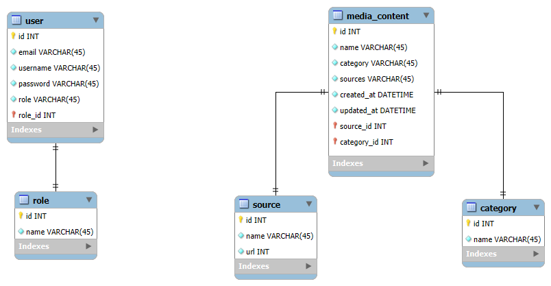

# Проєктування бази даних

## Модель бізнес-об'єктів

@startuml
entity User
entity User.username #FFFFFF 
entity User.password #FFFFFF
entity User.email #FFFFFF
entity User.id #FFFFFF
entity User.role #FFFFFF

User.username --* User 
User.password --* User 
User.email --* User 
User.id --* User
User.role --* User

entity Source
entity Source.id #FFFFFF
entity Source.url #FFFFFF
entity Source.name #FFFFFF

Source.id --* Source
Source.url --* Source
Source.name --* Source

entity Permission
entity Permission.id #FFFFFF
entity Permission.name #FFFFFF
entity Permission.description #FFFFFF

Permission.id --* Permission
Permission.name --* Permission
Permission.description --* Permission

entity Category
entity Category.id #FFFFFF
entity Category.name #FFFFFF

Category.id --* Category
Category.name --* Category

entity MediaContent
entity MediaContent.id #FFFFFF
entity MediaContent.name #FFFFFF
entity MediaContent.category #FFFFFF
entity MediaContent.sources #FFFFFF
entity MediaContent.created_at #FFFFFF
entity MediaContent.updated_at #FFFFFF

MediaContent.id --* MediaContent
MediaContent.name --* MediaContent
MediaContent.category --* MediaContent
MediaContent.sources --* MediaContent
MediaContent.created_at --* MediaContent
MediaContent.updated_at --* MediaContent

entity Role
entity Role.id #FFFFFF
entity Role.name #FFFFFF

Role.id --* Role
Role.name --* Role

entity Comment
entity Comment.id #FFFFFF
entity Comment.content #FFFFFF
entity Comment.created_at #FFFFFF

Comment.id --* Comment
Comment.content --* Comment
Comment.created_at --* Comment
Comment.updated_at --* Comment

entity Tag
entity Tag.id #FFFFFF
entity Tag.name #FFFFFF

Tag.id --* Tag
Tag.name --* Tag

User "0,*" -d- "1,1" Role
User "0,*" -d- "1,1" Permission
User "1,*" -d- "0,*" Comment
MediaContent "1,1" -d- "0,*" Category
MediaContent "1,1" -d- "0,*" Source
MediaContent "0,*" -d- "0,*" Tag
MediaContent "1,1" -d- "0,*" Comment

@enduml

## ER-модель

@startuml
entity "Role" {
    + id: Int 
    + name: Text
  }

entity "Comment" {
    + id: Int
    + content: Text 
    + created_at: Datetime
    + updated_at: Datetime
  }
 
entity "Tag" {
    + id: Int
    + name: Text
  }

entity "Permission" {
  + id: Int
  + name: Text
  + description: Text
}
  
entity "User" {
    + id: Int
    + email: Text
    + username: Text
    + password: Text
    + role: Text
  }
  
entity "Source" {
    + id: Int
    + name: Text
    + url: Int
  }

entity "MediaContent" {
    + id: Int
    + name: Text
    + category: Text  
    + sources: Text
    + created_at: Datetime 
    + updated_at: Datetime 
  }
  
    entity "Category" {
    + id: Int
    + name: Text
  }
  
User "0,*" -d- "1,1" Role
User "0,*" -d- "1,1" Permission
User "1,*" -d- "0,*" Comment
MediaContent "1,1" -d- "0,*" Category
MediaContent "1,1" -d- "0,*" Source
MediaContent "0,*" -d- "0,*" Tag
MediaContent "1,1" -d- "0,*" Comment

@enduml

## Реляційна схема

