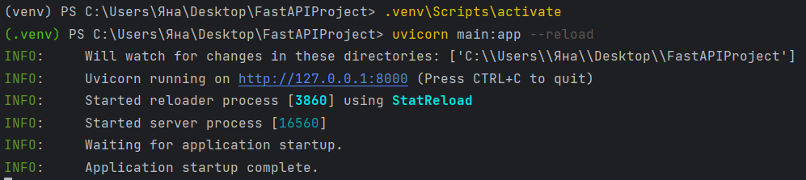
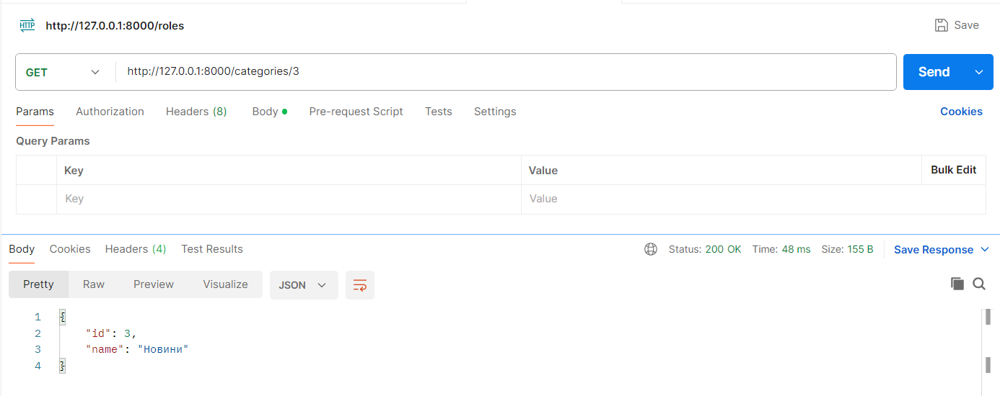
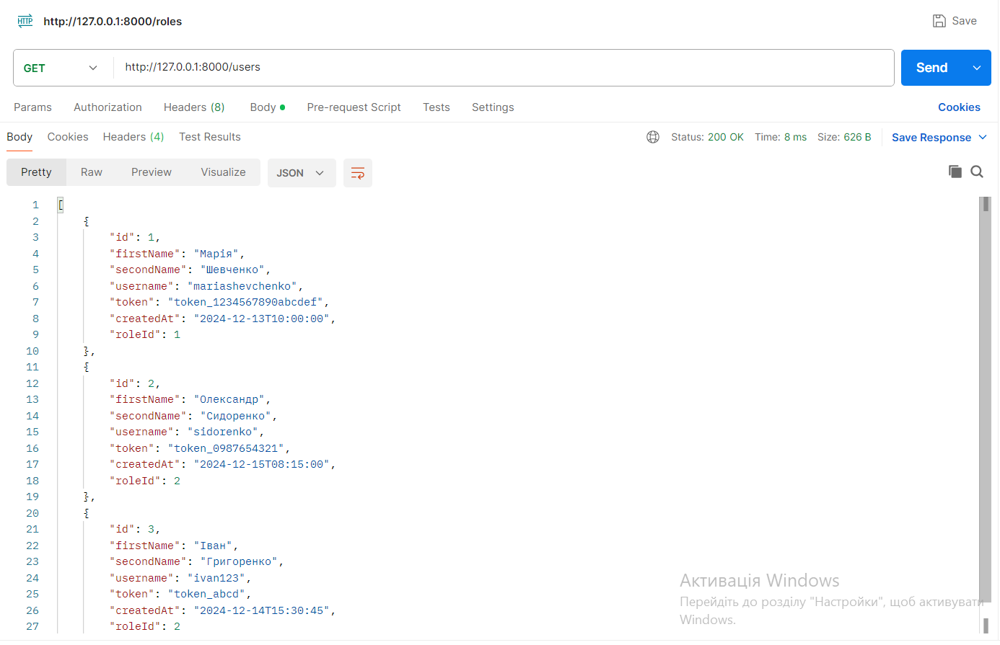
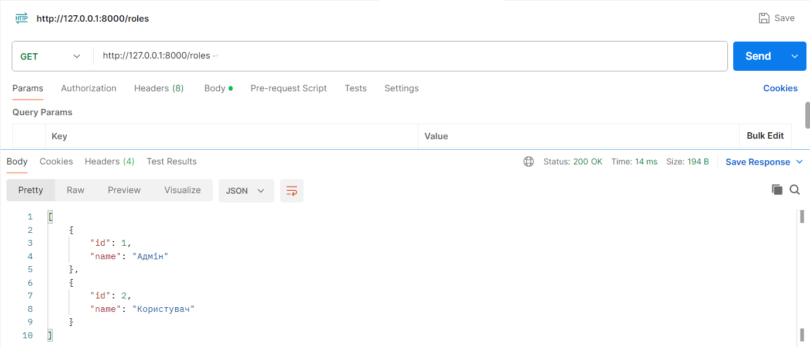
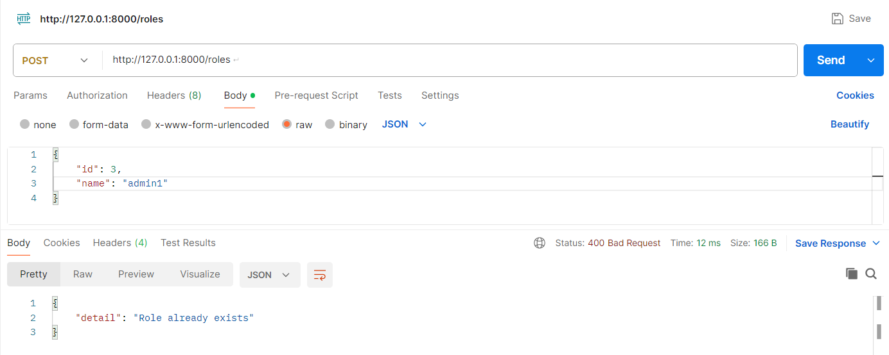
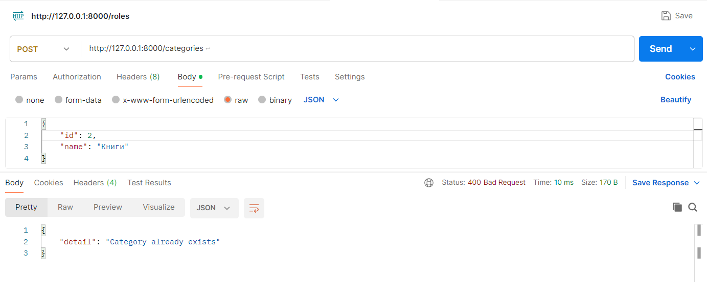
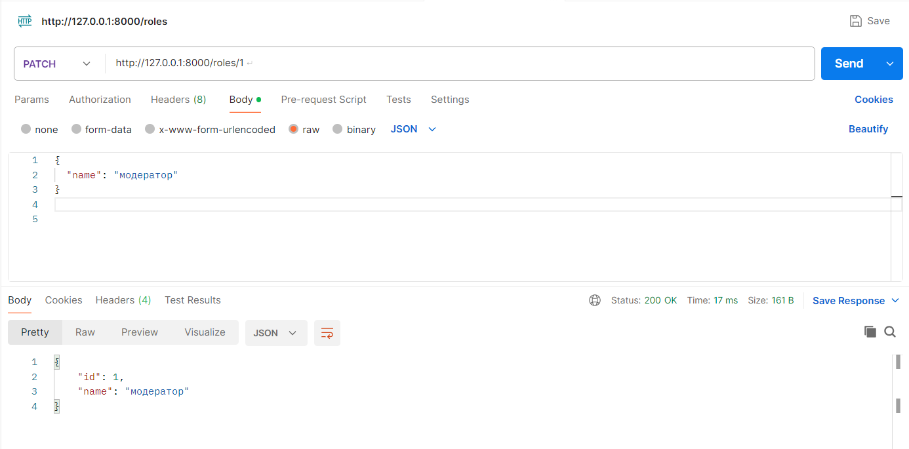
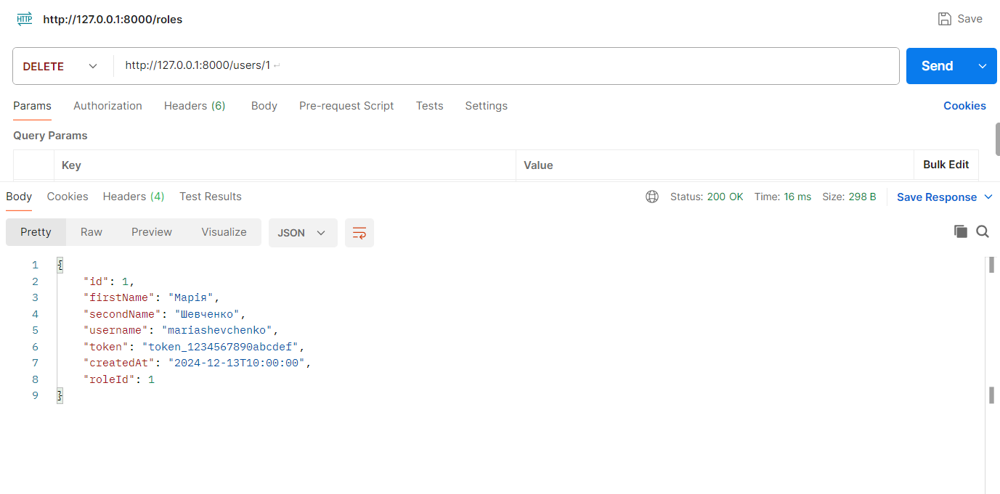
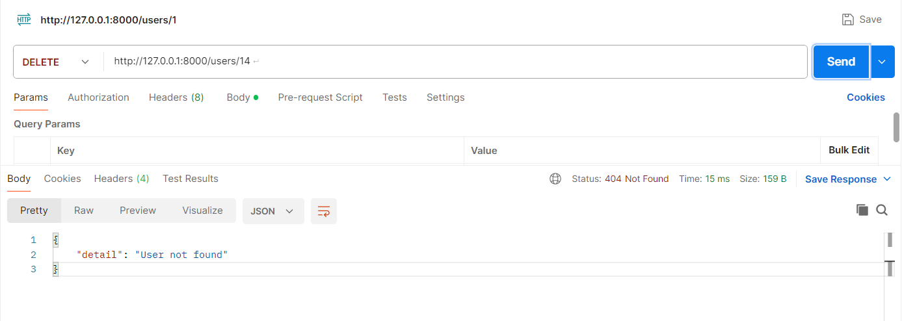

# Тестування працездатності системи

## Запуск сервера

## GET запити

### GET запит з використанням ID

### GET запит для отримання всіх даних

### GET запит для отримання всіх даних (інший приклад)

## POST запити

### POST запит

### POST запит: роль вже існує

### POST запит: категорія вже існує

## PATCH запити

### PATCH запит

### PATCH запит(інший приклад)

## DELETE запити

### DELETE запит

### DELETE запит: користувач не знайдений

